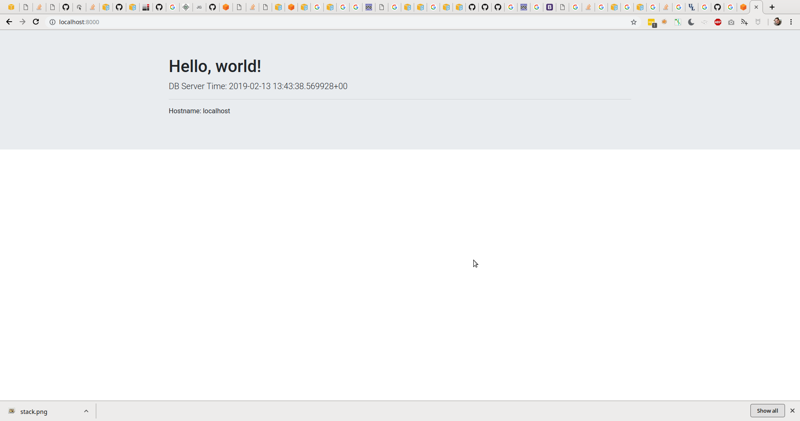

Application
===========

This part of the project provies a very basic PHP web
application.

## About



The application provides a very basic functionality
which includes the following:

1. Start PHP session (verify with `PHPSESSID` cookie)
2. Read environment configuration from `.env` file.
3. Connect to the PostgreSQL database.
4. Get the current timestamp from the database (`SELECT NOW()`).
5. Display database timestamp and current web hostname.

## Files

* `bin/composer` - PHP dependency manager
* `docs/` - documentation and screenshots
* `webroot/index.php` - PHP application
* `.env.example` - example environment configuration
* `composer.json` - composer dependencies for the application

## Requirements

In order to run this application, you'll need the following:

1. PHP 7+.
2. Web server that is configured to run PHP.
3. PostgreSQL database.

## Usage

The simplest way to run this application is:

```
# Install composer dependencies
composer install

# Create environment configuration
cp .env.example .env

# Adjust environment configuration
vim .env

# Run PHP built-in web server
cd webroot && php -S localhost:8000
```

