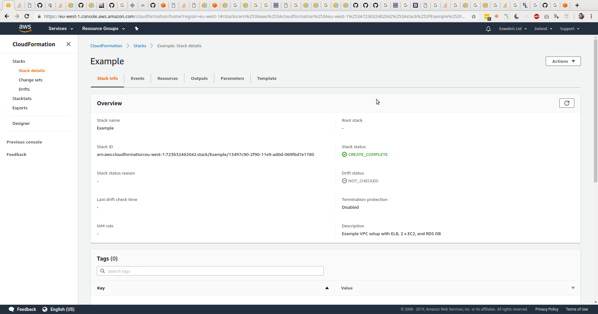

Amazon AWS
==========

This part of the project includes all the necessary bits for
creating and removing the Amazon AWS infrastructure.

## Files

* `bin/aws.sh` - a simple Bash script wrapper for Amazon AWS command-line client
* `cloudformation/templates/vpc.yml` - an Amazon CloudFormation template

## Requirements

In order for the Amazon AWS infrastructure provisioning to work properly, you'll
need the following:

1. Amazon AWS account.
2. Amazon AWS command line client.
  * Check if it is already installed with `which aws`.  You should see `/usr/bin/aws` or similar.
  * If not present, install with `sudo yum install awscli` or similar.
3. Amazon AWS credentials profile configured locally.
  * Check if it is already configured with `cat ~/.aws/credentials`.  You should see `[default]` or other sections.
  * If not present, create new Access Key in Amazon AIM users management and configure with `aws configure` locally.
4. SSH key pair for remote access to the servers.
  * If not present, create new Key Pair in Amazon EC2 administration interface.

## Usage

There are several to use the provided CloudFormation template.

### Web Interface


1. Login to [Amazon AWS Console](https://console.aws.amazon.com/console/home)
2. Select "[CloudFormation](https://eu-west-1.console.aws.amazon.com/cloudformation/home)" from the "Services" menu.
3. Click on "Create Stack" button.
4. Select "Template is ready"
5. Select "Upload a template file" 
6. Upload `cloudformation/templates/vpc.yml` file.
7. Click "Next" button.

### Command Line (AWS client)

Use Amazon AWS command line client to create and delete stacks.

```
# Create new stack
aws cloudformation create-stack --stack-name Example --template-body file://.../cloudformation/templates/vpc.yml

# Delete existing stack
aws cloudformation delete-stack --stack-name Example

# Help with paramaters
aws help
aws cloudformation help
```

### Command Line (Bash wrapper)

Use provided Bash script wrapper to create and delete stacks.

```
# Create new stack
./bin/aws.sh deploy Example

# Delete existing stack
./bin/aws.sh rollback Example

# Help with parameters
./bin/aws.sh help
```

## Infrastructure


The provided CloudFormation template creates resources, generates helpful outputs, and 
allows some control via the parameters.

### Parameters

The following parameters can be adjusted when creating new stacks:

* EC2KeyName - the name of the EC2 Key Pair for the SSH access to web server instances. Default: cloudformation.
* EC2InstanceType - the type of the EC2 instances to use for the web servers.  Default: t2.micro.
* DBInstanceType - the type of the EC2 instance to use for the RDS database server.  Default: db.t2.micro.
* DBName - the name of the database to create for the application.  Default: app.
* DBUser - the username to create for the database access.  Default: app.
* DBPass - the password to set for the database access user.  Default: app12345678.

### Outputs

Once the CloudFormation is successfully created, the following outputs provide helpful information:

* LBUrl - the URL for the web application access via the load balancer.
* WebServer1URL - the URL for the web application access directly to WebServer1.
* WebServer1SSH - the "ssh user@host" string for easy Secure Shell access to WebServer1.
* WebServer2URL - the URL for the web application access directly to WebServer2.
* WebServer2SSH - the "ssh user@host" string for easy Secure Shell access to WebServer2.

### Resources

The provided CloudFormation creates the following resources (high level) as part of the new stack:

* VPC - new Virtual Private Cloud
* InternetGateway - new Internet Gateway for VPC Internet access
* DefaultRouteTable - a single route table to manage network routing
* DefaultRoute - a single route rule to send all traffic via the Internet Gateway
* Subnet1 - a public subnet in "eu-west-1a" availability zone
* Subnet2 - a public subnet in "eu-west-1b" availability zone
* RDSDB - an RDS database instance with PostgreSQL in "eu-west-1a" zone available to both subnets
* Three security groups:
  1. WebSecurityGroup which allows incoming and outgoing traffic to ports 80 and 443
  2. SSHSecurityGroup which allows incoming and outgoing traffic to port 22
  3. DBSecurityGroup which allows incoming and outgoing traffic to port 5432 (PostgreSQL)
* Two web server instances:
  1. WebServer1 - CentOS 7 server in "eu-west-1a" availability zone
  2. WebServer2 - CentOS 7 server in "eu-west-1b" availability zone
* LoadBalancer - a Classic Elastic LoadBalancer instance for balancing traffic between web servers with session affinity

## Deployment

Here are a few screenshots from the Amazon AWS CloudFormation web interface, which illustrate
the deployment of the new stack.





